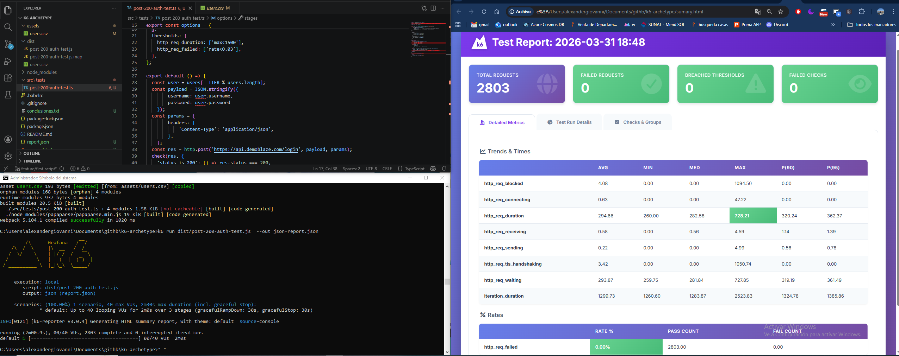
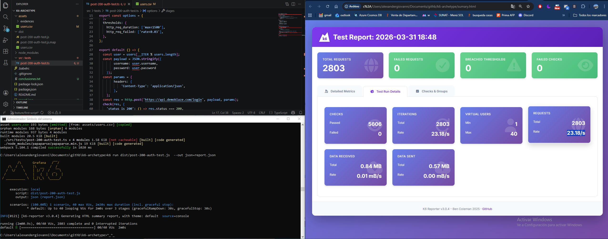
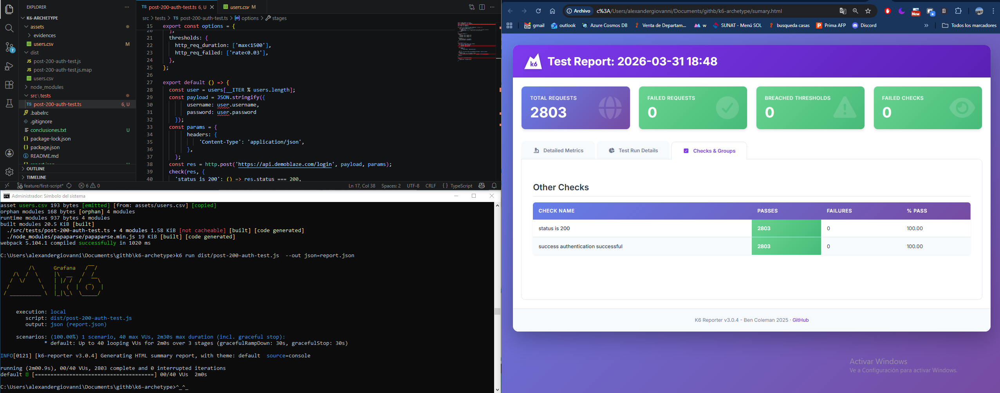

# Hi, I'm Alexander! 👋

This project is a framework for running performance tests
## Features

The following features are in the framework
- Load Tests
- Reading CSV files

## Installation

Tools
- [Visual Studio](https://code.visualstudio.com/download)
- [Choco](https://chocolatey.org/install)
- [Postman](https://www.postman.com/downloads/)

Project
```bash
  choco install git -y
  choco install nodejs.install
  choco install k6
```

## Deployment

Before execution please navigate to the project folder, open terminal and execute:
```bash
  npm install
  npm install papaparse
```

To deploy this project use always the follow command in the console:

```bash
  npm run bundle
  k6 run dist/post-200-auth-test.js  --out json=report.json
```
## Results




## Authors

- [@AlexanderGiovanni](https://github.com/AlexanderGamarra)


## Support

For support, email agamarrat@outlook.com